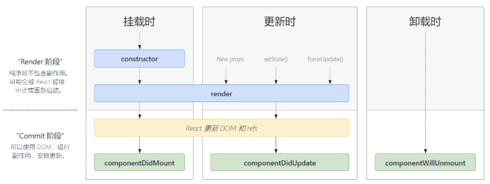

# 常用
## constructor(props)
类初始化 负责初始化
## render
将jsx转化成真实dom节点
## componentDidMount
组件第一次渲染完成时触发

dom已经生成，这里通常调用接口请求，返回数据后使用setState()更新数据后重新渲染。
## componentDidUpdate(prevProps, prevState)
组件更新完成时触发

每次重新渲染会调用这个接口， 可以拿到之前的props、state
## componentWillUnmount
组件销毁和卸载时触发

# 不常用

## getDerivedStateFormProps(nextProps,prevState)
更新state的回调

替代 componentWillReceiveProps()。

在当前生命周期中，禁止使用this.props，强制让开发者们通过比较nextProps和PrevState去保证数据的正确行为
## shouldComponentUpdate
性能优化用

return true可以渲染，return false不重新渲染

父组件渲染 阻止子组件重新渲染
## getSnapshotBeforeUpdate(prevProps,prevState)
替代 componentWillUpdate， 核心区别在于getSnapshotBeforeUpdate()中读取到的dom元素状态是可以保证和componentDidUpdate()中的一致。

